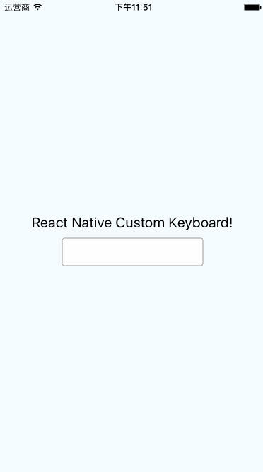

# React-Native-Custom-Keyboard

Custom Keyboard in React Native

React Native 自定义键盘

## 中文

目前react native关于键盘样式只提供了系统的键盘样式，但是没有提供自定义键盘的途径

在这里也没有真正意义上的实现自定义键盘，但是可以满足当下的需求

原理是实现一个自定义的`TextField`，通过自定义的`TextField`来调起自定义键盘，间接的达到目的

## English

Now React Native only provide some system keyboards, but not provide function for custom keyboard.

In here I also not realize really custom keyboard, but it can meet our requirements.

Actually I througt realize `custom TextField` to weak up the custom keyboard, by this way to touch our purpose.

## ToDo

## Contact me

Email:newfun.email@qq.com

--newfun.上海.2016年7月1日